<!-- ********************************************************************************************************************************* -->

# MultiXscale
> [!NOTE]
> WP3: Development and efficient implementation of interfaces for coupling different length scales

<!-- ********************************************************************************************************************************* -->

<!-- Flowchart -->
<!-- ## Overview -->
<details>
    <summary>Overview</summary>
    
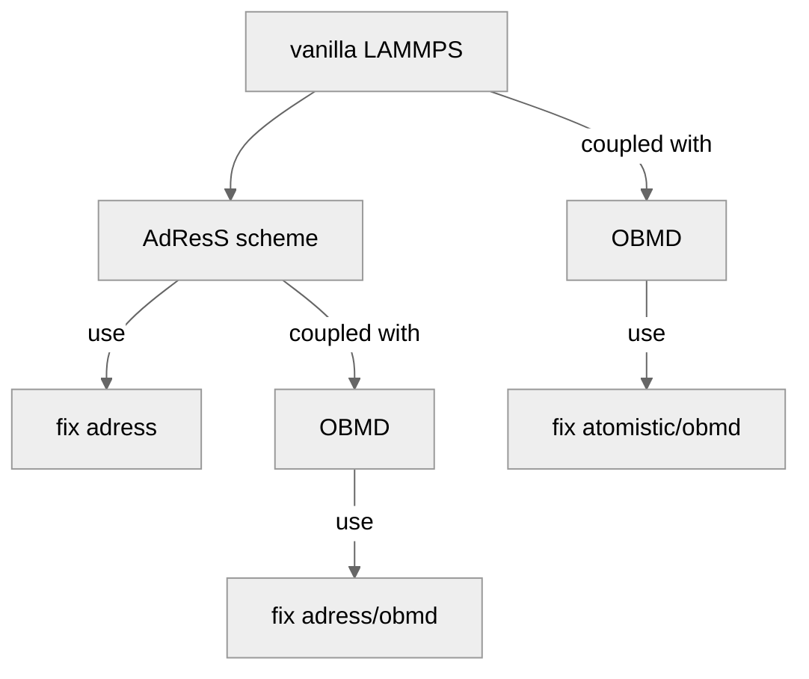

</details>

<!-- TODO list -->
<details> 
    <summary>To-do list</summary>
    <br>
    
- [ ] Clean the code (remove all comments that are of no use to end users)
- [x] Add "rigid SPC water" AdResS simulation results (equilibrium)
- [x] Add "rigid SPC water" shear flow results
- [ ] Create a list of all new pair styles added to LAMMPS
- [x] Create a list of all changes of the original LAMMPS source code (e.g., molecule.cpp and molecule.h)
- [x] Add caution section to inform users about some important details of the code or simulations
- [ ] Speed up of adress (changes are not yet commited !) : Add "if" in pair style adress (greater CG region should perform faster)
- [ ] Perform code profiling (adress, np, at)
- [ ] Test "nevery"
- [ ] Check lj/cut/rf and lj/cut/rf/kk
- [ ] changes in KOKKOS/kokkos_type.h (there!) and KOKKOS/install.sh

</details>

<!-- ********************************************************************************************************************************* -->
<!-- Removed methodology section -->

<!-- ********************************************************************************************************************************* -->
<!-- Testing -->

<br>

## Adaptive resolution simulation (AdResS) scheme

<p align="center">
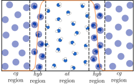
</p>

AdResS scheme allows the concurrent coupling of the fine-grained and coarse-grained (cg) description levels within the same simulation box. 
The outermost region is the cg region, where each molecule is represented by a single cg particle, whose interaction with other particles is determined by the effective potential. 
Molecules with a larger number of degrees of freedom (DOFs) are located within the atomistic (at) region, which is located in the center of the simulation box. 
The cg and at regions encompass a third region, referred to as the hybrid region (hyb). 
While moving across regions, particles in the hyb region gradually acquire or lose (depending on whether a molecule enters or leaves the at region) vibrational and rotational DOFs, whereby the coupling of molecular models is achieved using the **force interpolation formula**

```math
F_{{\alpha}{\beta}}= w(x_\alpha) w(x_\beta) \mathbf{F}_{\alpha\beta}^{at} + (1 - w(x_\alpha) w(x_\beta)) \mathbf{F}_{\alpha\beta}^{cg},
```

where $F_{{\alpha}{\beta}}$ represents the intermolecular force acting between center-of-masses (COMs) of molecules $\alpha$ and $\beta$, $F_{{\alpha}{\beta}}^{at}$ is the sum of all-atom pair interactions between explicit atoms of molecule $\alpha$ and molecule $\beta$, and $\mathbf{F}_{\alpha \beta}^{cg}$ is the cg force acting on the COMs. 
The latter two are
```math
\mathbf{F}_{\alpha \beta}^{at} = \displaystyle{\sum_{i\alpha, j\beta}} \mathbf{F}_{i\alpha j\beta}^{at},
```

where
```math
\quad \mathbf{F}_{i\alpha j\beta}^{at} = - \tfrac{\partial U^{at}}{\partial \mathbf{r}_{i\alpha j\beta}},
```

and
```math
\mathbf{F}_{\alpha \beta}^{cg} = - \tfrac{\partial U^{cg}}{\partial \mathbf{R}_{\alpha \beta}}.
```

Here, $`\mathbf{r}_{i\alpha j\beta} = \mathbf{r}_{i\alpha} - \mathbf{r}_{j\beta}`$ is the relative position vector of atom $i$ in molecule $\alpha$ and atom $j$ in molecule $\beta$ and $`\mathbf{r}_{\alpha\beta} = \mathbf{r}_{\alpha} - \mathbf{r}_{\beta}`$ is the relative position vector of COMs of molecules $\alpha$ and $\beta$. 
In the force interpolation formula, $w$ stands for the weighting function that defines the molecules’ resolution. 
For molecules inside the at region $w=1$, while for molecules within the cg region $w=0$.[^1]

<br>
<br>
<hr>

We implement the AdResS simulation technique in LAMMPS and test it on a model system of liquid tetrahedral molecules.[^1]
[^1]: M. Praprotnik et. al., *J. Chem. Phys.* **123**, 224106 (2005)

<hr>

### ${\color{#EC5800}AdResS\ simulation - Tetraliquid\ (medium\ dense\ liquid)}$

Added **pair_style morse/adress/cg** → cg contribution

$U^{cg} (r) = \gamma \left[ 1 - e^{-\kappa ( r - r_0)} \right]^2$

```bash
pair_style morse/adress/cg {rc_{cg}}
pair_coeff {type1} {type2} {gamma} {kappa} {r0} {rc_{cg}}
```
<details>
    <summary>Details</summary>
    Pair style <strong>morse/adress/cg</strong> computes (cg) forces and takes cutoff of the effective interaction ({rc_{cg}}) as an argument. 
    For each pair of atom types (defined by {type1} and {type2}), the following coefficients must be determined:
   
    {gamma} (energy units)
    {kappa} (1/distance units)
    {r0} (distance units)
    {rc_{cg}} (distance units) ... optional parameter
</details>

Added **pair_style lj/cut/adress/at** → at contribution

$U_{LJ}^{at} (r_{i\alpha j\beta}) = 4 \varepsilon \left[ \left( \frac{\sigma}{r_{i\alpha j\beta}} \right)^{12} -  \left( \frac{\sigma}{r_{i\alpha j\beta}} \right)^{6} \right] \quad \text{if} \quad r_{i\alpha j\beta} \le r_c$

$\epsilon$ ... well depth

$\sigma$ ... distance at which the intermolecular potential between the two particles is zero

$r_{i\alpha j\beta}$ ... distance between atom $i\alpha$ of molecule $\alpha$ and atom $j\beta$ of molecule $\beta$

$r_c$ ... cutoff distance

```bash
pair_style lj/cut/adress/at {rc_{at}}
pair_coeff {type1} {type2} {epsilon} {sigma} {rc_{at}}
```
<details>
    <summary>Details</summary>
    Pair style <strong>lj/cut/adress/at</strong> computes (at) forces and takes cutoff of the Lennard-Jones (LJ) interaction ({rc_{at}}) as an argument.
    For each pair of atom types (defined by {type1} and {type2}), the following coefficients must be defined:
    
    {epsilon} (energy units)
    {sigma} (distance units)
    {rc_{at}} (distance units) ... optional parameter
</details>

#### ${\color{#0096FF}AdResS\ simulation - Tetraliquid\ (medium\ dense\ liquid) → RESULTS}$

<p align="center">
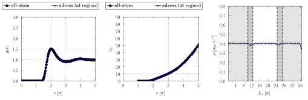
</p>

Radial distribution function (left), average number of neighbors (middle), and mass density profile (right).

<!-- ********************************************************************************************************************************* -->
<br>
<br>
<hr>

Due to density fluctuations around the reference value in the transition region, we aim to flatten the density profile by introducing the interface pressure correction.
The cg contribution of the force interpolation formula is rewritten into[^2]

```math
\mathbf{F}_{\alpha \beta}^{cg} = s[w(x_\alpha) w(x_\beta)]\mathbf{F}_{\alpha \beta}^{cg,org} + (1 - s[w(x_\alpha) w(x_\beta)])\mathbf{F}_{\alpha \beta}^{cg,ic},
```

where $`\mathbf{F}_{\alpha \beta}^{cg,org}`$ and $`\mathbf{F}_{\alpha \beta}^{cg,ic}`$ are the "original" effective pair force and "interface correction" force, respectively, while the function $s \in [0,1]$ is expressed as

```math
s[k] = 4 \left( \sqrt{k} - \frac{1}{2} \right)^2.
```

Again, the AdResS simulation technique with the interaface pressure correction is tested on a model system of liquid tetrahedral molecules.[^1][^2]
[^2]: M. Praprotnik et. al., *Phys. Rev. E* **73**, 066701 (2006)

<hr>

### ${\color{#EC5800}AdResS\ simulation\ with\ interface\ pressure\ correction\ (ipc) - Tetraliquid\ (medium\ dense\ liquid)}$

Added **pair_style morse/adress/cg/ipc/org** → cg contribution ("original" effective pair force)

```bash
pair_style morse/adress/cg/ipc/org {rc_{cg}}
pair_coeff {type1} {type2} {gamma} {kappa} {r0} {rc_{cg}}
```

Added **pair_style morse/adress/cg/ipc/corr** option → cg contribution ("interface correction" force)

```bash
pair_style morse/adress/cg/ipc/corr {rc_{cg}}
pair_coeff {type1} {type2} {gamma_{ic}} {kappa} {r0} {rc_{cg}}
```
<details>
    <summary>Details</summary>
    Pair styles <strong>morse/adress/cg/ipc/org</strong> and <strong>morse/adress/cg/ipc/corr</strong> calculate (cg) forces and take cutoff of the effective interaction ({rc_{cg}}) as an argument.
    The following coefficients must be specified for each pair of atom types (defined using {type1} and {type2}):

    {gamma} or {gamma_{ic}} (energy units)
    {kappa} (1/distance units)
    {r0} (distance units)
    {rc_{cg}} (distance units) ... optional parameter
</details>


#### ${\color{#0096FF}AdResS\ simulation\ with\ ipc - Tetraliquid\ (medium\ dense\ liquid) → RESULTS}$

<p align="center">
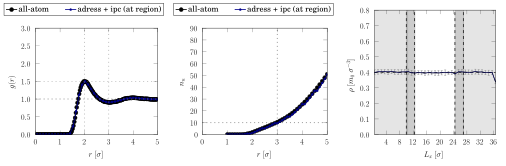
</p>

Radial distribution function (left), average number of neighbors (middle), and mass density profile (right).

<br>

> [!NOTE]
> Example simulations are available at **/temp/petra/workspace/lmp_4mxsc/develop/fadress/at_12_hy_2.5** and **/temp/petra/workspace/lmp_4mxsc/develop/fadress/at_12_hy_2.5_ipc**
> 
> Inspect **pp_lmp/examples/fadress/tetraliquid** directory on GitHub

<!-- ********************************************************************************************************************************* -->
<br>
<br>
<hr>

We employ simple point charge (SPC) water model[^3] and perform additional AdResS simulations, where electrostatic interactions are treated using the **reaction field method**[^4]

```math
U_{rf} (r_{i\alpha j\beta}) = \frac{q_{i\alpha} q_{j\beta}}{4 \pi \varepsilon_0 r_{i\alpha j\beta}} \left[ 1 + \frac{\varepsilon_{rf} - 1}{2\varepsilon_{rf} +1} \left(\frac{r_{i\alpha j\beta}}{r_c} \right)^3 \right] - \frac{q_{i\alpha} q_{j\beta}}{4 \pi \varepsilon_0 r_c} \frac{3\varepsilon_{rf}}{2\varepsilon_{rf} +1}.
```

Here, $q$, $\varepsilon_0$, and $\varepsilon_{rf}$ stand for the electric charge, vacuum permitivity, and dielectric constant of dielectric continuum, respectively.
[^3]: H. J. C. Berendsen et. al., *J. Phys. Chem.* **91**, 6269-6271 (1987)
[^4]: M. Heidari et. al., *Eur. Phys. J. Spec. Top.* **225**, 1505-1526 (2016)

<hr>

### ${\color{#EC5800}Atomistic\ simulation - rigid\ SPC\ water\ model}$

Added **pair_style lj/cut/rf(/kk)** 

```bash
pair_style lj/cut/rf(/kk) {rc_{lj}} {rc_{rf}}
pair_coeff {type1} {type2} {epsilon} {sigma} {rc_{lj}} {rc_{rf}} {epsilon_{rf}}
```
<details>
    <summary>Details</summary>
    Pair style <strong>lj/cut/rf(/kk)</strong> computes LJ potential and treats electrostatic interactions using the reaction field method.
    It takes cutoffs of the LJ interaction ({rc_{at}}) and electrostatic interaction ({rc_{rf}}) as arguments. 
    For each pair of atom types (defined by {type1} and {type2}), the following coefficients must be determined:

    {epsilon} (energy units)
    {sigma} (distance units)
    {rc_{lj}} (distance units) ... optional parameter
    {rc_{rf}} (distance units) ... optional parameter
    {epsilon_{rf}}
</details>

### ${\color{#EC5800}AdResS\ simulation - rigid\ SPC\ water\ model}$

Added **pair_style table/adress/obmd/cg** → cg contribution

```bash
pair_style table/adress/obmd/cg {style} {N}
pair_coeff {type1} {type2} {filename} {keyword} {rc_{cg}}
```
<details>
    <summary>Details</summary>
    Pair style <strong>table/adress/obmd/cg</strong> computes (cg) forces.
    It takes as arguments the interpolation method ({style}) and the number of values ({N}) in the table. 
    For each pair of atom types (defined by {type1} and {type2}), the following coefficients must be assigned:

    {filename}
    {keyword}
    {rc_{cg}} (distance units)
</details>

Added **pair_style lj/cut/rf/adress/at** → at contribution

```bash
pair_style lj/cut/rf/adress/at {rc_{lj}} {rc_{rf}}
pair_coeff {type1} {type2} {epsilon} {sigma} {rc_{lj}} {rc_{rf}} {epsilon_{rf}}
```
<details>
    <summary>Details</summary>
    Pair style <strong>lj/cut/rf/adress/at</strong> computes (at) froces.
    The arguments are the LJ interaction ({rc_{at}}) and electrostatic interaction ({rc_{rf}}) cutoffs. 
    The following coefficients must be specified for each pair of atom types (defined using {type1} and {type2}):

    {epsilon} (energy units)
    {sigma} (distance units)
    {rc_{lj}} (distance units) ... optional parameter
    {rc_{rf}} (distance units) ... optional parameter
    {epsilon_{rf}}
</details>

#### ${\color{#0096FF}AdResS\ simulation - rigid\ SPC\ water\ model → RESULTS}$

<p align="center">
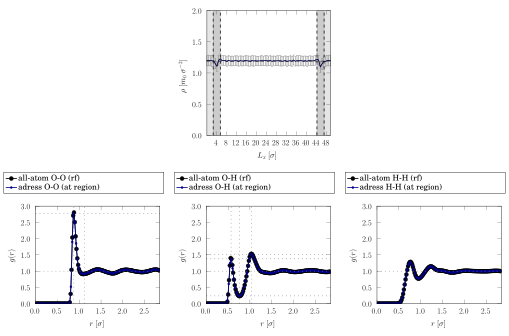
</p>

Mass density profile (top) and radial distribution functions (bottom).

<!-- ********************************************************************************************************************************* -->
<br>
<br>
<br>

### Code profiling

`12432 atoms, SPC water, 500 steps, 1 processor, timer full sync off` 

<p align="center">
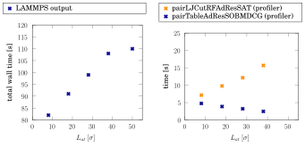
</p>
Profiler data.

<!-- ********************************************************************************************************************************* -->
<br>
<br>
<br>

> [!CAUTION]
> The **effective potential** $U^{cg}$ in tabular form **must be provided by the user**.
>
> It can be obtained by the iterative Boltzmann inversion method.[^5][^6]

> [!CAUTION]
> AdResS scheme works only when used in combination with **morse/adress/cg**, **lj/cut/adress/at**, **table/adress/obmd/cg**, and **lj/cut/rf/adress/at** pair styles.
> However, it can *easily* be extended to other pair styles.

> [!TIP]
> Use thermodynamic force,[^7] implemented as **fix tdforce**, to flatten density density profile in the transition region.
>
> `fix {id} {groip-id} tdforce {style} {N} {filename} {keyword}`
>
> New fix style takes as arguments the interpolation method (**{style} == lookup**), the number of values ({N}) in the table, filename {filename}, and keyword {keyword}.
> **The thermodynamic force must be iterated and provided by the user.**

> [!NOTE]
> Example simulations are available at **/temp/petra/workspace/lmp_4mxsc/develop/fadress/rigid_spc/at_38_hy_2.8**
> 
> Inspect **pp_lmp/examples/fadress/rigid_spc** directory on GitHub

[^5]: G. Milano et. al., *J. Phys. Chem. B* **109**, 18609-18619 (2005)
[^6]: S. Bevc et. al., *J. Comput. Chem.* **36**, 467-477 (2015)
[^7]: L. Delle Site and M. Praprotnik, *Sci. Rep.* **693**, 1-56 (2017)

<!-- ********************************************************************************************************************************* -->
<br>
<br>
<hr>

In addition, AdResS scheme facilitates insertion of complex molecules into the system, as used in open-boundary molecular dynamics (OBMD) method.[^7][^8]
[^8]: R. Delgado-Buscalioni et. al., *J. Chem. Phys.* **128**, 114110 (2008)

<hr>

## Open-boundary molecular dynamics (OBMD) method

<p align="center">
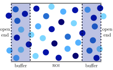
</p>

The OBMD allows the exchange of molecules,[^7][^9][^10] where the simulation box is opened in one direction, while periodic boundary conditions are imposted on the remaining ones.[^
Commonly it is divided into three regions (as depicted above), where the central region of interest (ROI) is enclosed by two buffer regions. 
Buffers serve as particle reservoirs from which molecules are deleted and inserted into the system. 
The number of particles is maintained using a simple feedback algorithm
[^9]: Flekkøy et. al., *Phys. Rev. E* **72**, 026703 (2005)
[^10]: R. Delgado-Buscalioni et. al., *Eur. Phys. J. Spec. Top.* **224**, 2331–2349 (2015)

```math
\Delta N_{b} = \frac{\delta t}{\tau_{b}} (\langle N_{b} \rangle - N_{b}),
```

where $\langle N_{b} \rangle$ and $N_{b}$ are the desired and current number of particles inside the buffer, respectively, while $\tau_{b}$ represents the relaxation time of the buffer.
When there are more particles in the buffer than $\langle N_{b} \rangle$, i.e., when $\Delta N_{b} < 0$, particles need to be deleted from the system. 
In practice, particles are not deleted immediately but are rather left to diffuse across the outer boundary of the buffer and then deleted. 
Conversely, new particles are inserted when $\Delta N_{b} > 0$, implying that there are fewer particles inside the buffer than desired. 
The insertion of new particles is carried out by the iterative USHER[^11] algorithm. 
Moreover, the buffers are also utilized to introduce external boundary conditions (while keeping the equations of motion unchanged).
[^11]: R. Delgado-Buscalioni and P. V. Coveney, *J. Chem. Phys.* **119**, 978–987 (2003).

<br>

To impose external boundary conditions, the OBMD method employs external forces $`\mathbf{f}_{i}^{ext}`$ acting only on particles within buffers, i.e., $`\mathbf{f}_{i}^{ext} = 0`$ everywhere else. In addition, in OBMD, the *total linear momentum* is conserved, which directly stems from the Navier-Stokes equation, coming on top of the linear momentum conservation law

```math
\frac{\partial (\rho \mathbf{v})}{\partial t} = - \nabla \cdot \mathsf{J}^{p}.
```

Here, $\rho$, $\mathbf{v}$, and $\mathsf{J}^{p}$ are the fluid density, fluid velocity, and momentum flux tensor. The latter is expressed as

```math
\mathsf{J}^{p} = \rho \mathbf{v} \otimes \mathbf{v} + \mathsf{\Pi},
```

where $\mathsf{\Pi}$ is the stress tensor, given by

```math
\mathsf{\Pi} = (P + \pi) \mathsf{I} + \overline{\mathsf{\Pi}}.
```

The first term on the rhs is diagonal, where $P$ stands for the thermodynamic pressure, and $`\pi = - \zeta \nabla \cdot \mathbf{v}`$ is the isotropic stress.
The second term is a traceless symmetric tensor whose components are

```math
\overline{\mathsf{\Pi}}_{\alpha \beta} = - \eta (\partial_{\alpha} v_{\beta} + \partial_{\beta} v_{\alpha} - 2 \partial_{\gamma} v_{\gamma} \delta_{\alpha \beta} D^{-1}).
```

Here, $D$ stands for the spatial dimension, while symbols $\eta$ and $\zeta$ denote shear and bulk viscosity coefficient, respectively.

<br>

In OBMD, boundary conditions are defined by the normal component of the momentum flux, i.e., $\mathsf{J}^{p} \cdot \mathbf{n}$.[^9]
By reformulating the momentum flux balance equation for the OBMD boundary of surface $A$,

```math
\mathsf{J}^p \cdot \mathbf{n}\ A \ {\delta}t = \displaystyle{\sum_{i \in B}} \mathbf{f}^{ext}_{i} \ {\delta}t + \displaystyle{\sum_{i'}} {\Delta} (m_{i'} \mathbf{v}_{i'}),
```

 we arrive at the expression for the total external force $\mathbf{F}^{ext}$:

 ```math
\mathbf{F}^{ext} = \displaystyle{\sum_{i \in B}} \mathbf{f}^{ext}_{i} = A \left( \mathsf{J}^{p} \cdot \mathbf{n} - \frac{\displaystyle{\sum_{i' \in B}} {\Delta} (m_{i'} \mathbf{v}_{i'})}{A {\delta}t} \right).
```

Indices $i$ and $i'$ run over all particles in the buffers and over all particles that have been inserted into or deleted from the system in the last time step, respectively. 
Accordingly, momentum change is given by $`{\Delta} (m_{i'} \mathbf{v}_{i'}) = \pm m_{i'} \mathbf{v}_{i'}`$ if particle $i'$ is inserted (+) or deleted (-), where $m_{i'}$ and $\mathbf{v}_{i'}$ stand
for the mass and velocity of particle $i'$, respectively.
Ultimately, the total external force $\mathbf{F}^{ext}$ is distrubuted among all particles in the buffer using

```math
\mathbf{f}^{ext}_{i} = \mathsf{G}(\mathbf{r}_{i}) \mathbf{F}^{ext},
```

where $\mathsf{G}(\mathbf{r}_{i})$ is the weighting function.[^10]

<br>
<br>
<hr>

We implement OBMD in LAMMPS and test it on a model system of rigid SPC water molecules.

<hr>

### ${\color{#EC5800}AdResS\ scheme\ and\ OBMD\ method - rigid\ SPC\ water\ model}$

Added **fix adress/obmd** → fix style to couple AdResS technique with OBMD method

```bash
fix {id} {group-ID} adress/obmd {insert-type} {nevery} {seed} {pxx} {pxy} {pxz} {dpxx} 
0.0 0.0 0.0 region1 {id1} region2 {id2} region3 {id3} region4 {id4} region5 {id5} region6 {id6}
buffersize {buffer_size} shearsize {shear_size} alpha {buffer_alpha} tau {buffer_tau} nbuf 
{n_buffer} gfac {gfac} step 0 attempt 1 near 0 {r} usher {usher_flag} {etgt} {ds0} {dtheta} 
{uovlp} {dsolvp} {eps} {max_attempt_usher} mol {molfile} {natom} shake {fix-id}
```
<details>
    <summary>Syntax</summary>
    No details
 <!--   {id} fix id
    {group-ID} group on which fix is performed
    {insert-type} type of inserted particles
    {nevery} on this many steps insertion is performed
    {seed} random number
    {pxx} normal load
    {pxy} and {pxz} off-diagonal components of pressure tensor
    {dpxx} pressure amplitude (for now not in use)
    {id1} left buffer region ID 
    {id2} right buffer region ID
    {id3} left shear flow region ID
    {id4} right shear flow region ID
    {id5} left buffer region ID to insert particles
    {id6} right buffer region ID to insert particles
    {buffer_size} size of a buffer
    {shear_size} size of a region to impose shear flow (not sure if it is used)
    {buffer_alpha} coefficient to reduce the desired number of particles in the buffers
    {buffer_tau} relaxation time of buffers
    {n_buffer} desired number of particles in buffers
    {gfac} for smooth transition  -->
    
</details>

#### ${\color{#0096FF}AdResS/OBMD\ simulation - rigid\ SPC\ water\ model → RESULTS\ (equilibrium)}$

<p align="center">
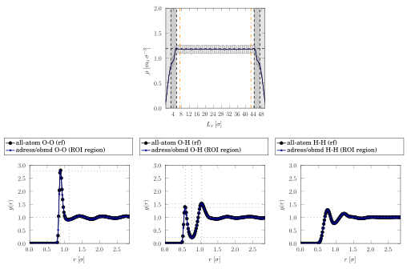
</p>

Mass density profile (top) and radial distribution functions (bottom).

<br>

> [!CAUTION]
> In `try_inserting`, $`atom→lambdaF[n] = 0.0`$ (particle needs to be inserted in the **cg part of the buffer** where weighting function, that defines resolution of the inserted particle, is 0)
> 
> In `post_force`, for now only `reg_force` is enabled

> [!CAUTION]
> **fix adress/obmd** works only with pair styles **table/adress/obmd/cg** and **lj/cut/rf/adress/at**
>
> See `energy_cg_adress_obmd` (in principle, effective potential is given in table form)

> [!CAUTION]
> Simulations must be performed in **reduced units**

> [!WARNING]
> Region for molecule insertion should be **narrowed** (due to PBC in `usher` function) → *think about other solutions*
>
> In `usher`, `check_mol_region` is used (if particle is not in the region → `break`). What about `try_new_position`?

> [!NOTE]
> Example simulations are available at **/temp/petra/workspace/lmp_4mxsc/develop/fadress_obmd/rigid_spc**
> 
> Inspect **pp_lmp/examples/fadress_obmd/rigid_spc** directory on GitHub
> 
<br>

<!-- TODO list -->
<details> 
    <summary>To-do list</summary>
    <br>
    
- [ ] Continue with the development of the adress/obmd code (non-equilibrium conditions)
- [x] Check if {shear_size} is used ({shear_size} is not used) 
- [x] Check default setting of near (0 by default)
- [ ] Extend to other pair styles (e.g., morse to test tetraliquid)

</details>

<!-- ********************************************************************************************************************************* -->

### ${\color{#EC5800}Atomistic\ simulation\ and\ OBMD\ method - rigid\ SPC\ water\ model}$

Added **fix atomistic/obmd** → fix style to conduct all-atom OBMD simulations

```bash
fix ${id} ${group-ID} atomistic/obmd ${insert-type} ${nevery} ${seed} ${pxx} ${pxy} ${pxz}
${dpxx} ${freq} region1 ${id1} region2 ${id2} region3 ${id3} region4 ${id4} region5 ${id5} 
region6 ${id6} buffersize ${buffer_size} gfac ${gfac} stepparallel ${step_parallel} stepperp 
${step_perp} maxattempt ${max_attempt} usher ${usher_flag} ${buffer_alpha} ${buffer_tau}
${n_buffer} ${etgt} ${ds0} ${dtheta} ${uovlp} ${dsolvp} ${eps} ${max_attempt_usher} mol ${molfile}
${natom} shake ${fix-id}
```
<details>
    <summary>Syntax</summary>

   No details
    
</details>

#### ${\color{#0096FF}Atomistic/OBMD\ simulation - rigid\ SPC\ water\ model → RESULTS\ (equilibrium)}$

<p align="center">
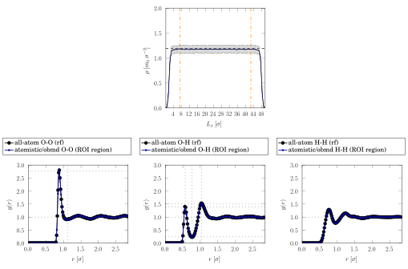
</p>

Mass density profile (top) and radial distribution functions (bottom).

#### ${\color{#0096FF}Atomistic/OBMD\ simulation - rigid\ SPC\ water\ model → RESULTS\ (sound\ wave)}$

Sound wave with frequency $\nu$ is introduced as the sum of the equilibrium pressure $P_{0}$ and the oscillatory pressure contribution with amplitude $\Delta p$ from one side of the simulation domain.
Accordingly, the momentum flux tensor components are expressed as[^12]
[^12]: P. Papež and M. Praprotnik, *J. Chem. Theory Comput.* **18**, 1227-1240 (2022)

```math
\mathsf{J}_{ij}^p = \left[ P_{0} + {\Delta} p \sin(2\pi \nu t) \right] {\delta}_{ij}
```

for the side where sound wave is excited, and 

```math
\mathsf{J}_{ij}^p = P_{0} {\delta}_{ij}
```
for the opposite side.

<br>

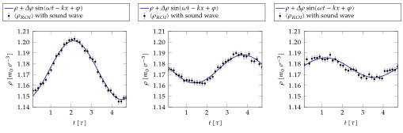

Denisty variation over time at $x_{ROI} = 0.0 \ \sigma$ (left),  $x_{ROI} \approx 14 \ \sigma$ (middle) and $x_{ROI} \approx 33 \ \sigma$ (right).

<br>

<p align="center">
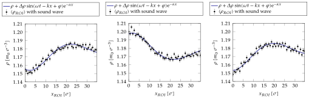
</p>

Denisty variation through the ROI at $t=0.12\ \tau$ (left), $t \approx 2.4 \ \tau$ (middle), and $t \approx 4.5 \ \tau$ (right).

#### ${\color{#0096FF}Atomistic/OBMD\ simulation - rigid\ SPC\ water\ model → RESULTS\ (shear\ flow)}$

In the case of shear flow, the components of the momentum flux tensor are: $`\mathsf{J}_{11}^{p} =\rho \dot{\gamma}^2 + 𝑃`$, $`\mathsf{J}_{12}^{p} = \mathsf{J}_{21}^{p} = − \eta \dot{\gamma}`$, $`\mathsf{J}_{22}^{p} = \mathsf{J}_{33}^{p} = P`$, and $`\mathsf{J}_{13}^{p} = \mathsf{J}_{31}^{p} = \mathsf{J}_{23}^{p} = \mathsf{J}_{32}^{p} = 0`$.
Here, $\dot{\gamma}$ is shear rate of a flow and $x_2$ is the coordinate in the open direction (i.e., gradient direction).[^13]
[^13]: J. Sablić et. al., *Soft Matter.* **12**, 2416-2439 (2016)

<br>

<p align="center">
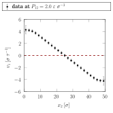
</p>

Velocity profile.


> [!CAUTION]
> Changes to **LAMMPS source code** (atom_vec.cpp, atom_vec.h, molecule.cpp, molecule.h)

> [!CAUTION]
> **fix atomistic/obmd** works only with pair style **lj/cut/rf**
>
> See `energy_atomistic_obmd`

> [!CAUTION]
> Simulations must be performed in **reduced units**

> [!WARNING]
> Region for molecule insertion should be **narrowed** (due to PBC in `usher` function) → *think about other solutions*
>
> In `usher`, `check_mol_region` is used (if particle is not in the region → `break`). What about `try_new_position`?

> [!NOTE]
> Example simulations are available at **/temp/petra/workspace/lmp_4mxsc/develop/atomistic_obmd/rigid_spc**
>
> Example simulations are available at **/temp/petra/workspace/lmp_4mxsc/develop/atomistic_obmd/rigid_spc_sound**
>
> Example simulations are available at **/temp/petra/workspace/lmp_4mxsc/develop/atomistic_obmd/rigid_spc_shear**
> 
> Inspect **pp_lmp/examples/atomistic_obmd/rigid_spc** directory on GitHub (equilibrium simulation)

<br>

<!-- TODO list -->
<details> 
    <summary>To-do list</summary>
    <br>
    
- [ ] Continue with the development of the atomistic/obmd code (optimize code)
- [ ] Extend to other pair styles

</details>
